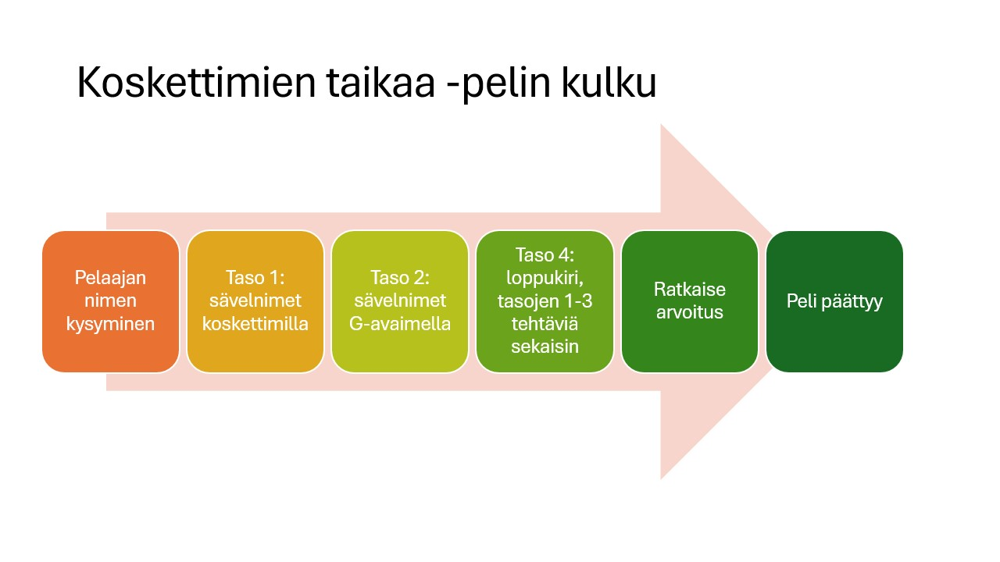

# Interaktiivinen tekstipohjainen Koskettimien taikaa -peli  

Koskettimien taikaa -peli on tekstipohjainen ja interaktiivinen peli, jossa opetellaan sävelnimiä ja niiden järjestystä koskettimilla ja viivastolla. Tämä peli on luotu ohjelmointikurssin projektina. 

Peli on tarkoitettu vasta-alkajalle harjoituttamaan nuotinluvun perusteita. Sävelnimien harjoittelu ja niiden yhdistäminen koskettimiin on keskeinen osa nuotinlukutaitoa. Kysymys on matemaattisesta taidosta: säveljono voidaan rinnastaa matematiikan lukujonokäsitteeseen ja taitoihin, joita kutsutaan lukujonotaidoiksi. Musiikissa näitä taitoja voidaan kutsua säveljonotaidoiksi ja ne ovat abstraktiotasoltaan vaativampia kuin matematiikan peruskäsitteet. 


## Ohjelman käynnistäminen  

Ohjelma käyttää Python-ohjelmointikieltä ja on suunniteltu toimimaan komentorivillä.  

1. **Asenna Python**  
   - Lataa ja asenna Python 3 viralliselta sivustolta:  
     [https://www.python.org/downloads/](https://www.python.org/downloads/)  
   - Asennuksen aikana varmista, että valitset kohdan *"Add Python to PATH"*.  

2. **Lataa ohjelma GitHub-repositorysta**  
   Suorita seuraavat komennot komentorivillä (Terminal tai Command Prompt):  
   ```bash
   git clone <repository_url>  
   cd <repository_directory>

3. **Ohjelma käynnistetään Command Promptissa kutsumalla komentorivillä** 

   ```bash
   python pianopeli.py

# Demovideo
https://youtu.be/rKPNPCdhN60

# Koskettimien taikaa diat
[Esitysdiat](Pianopeli.pdf)


